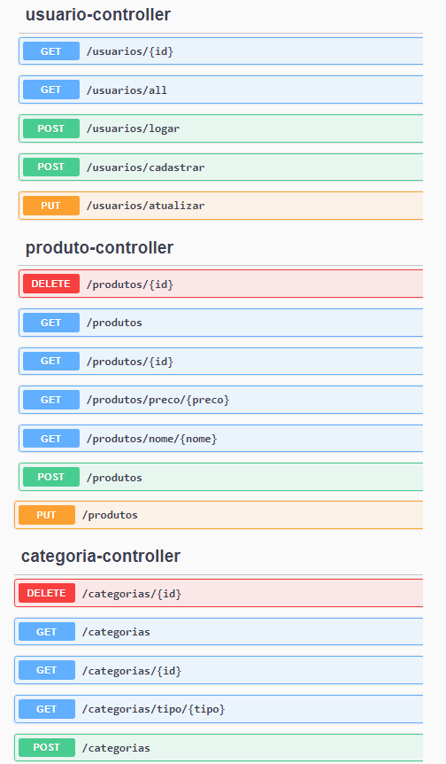

<h1 align="center"> Backend do site Sustenta Tech</h1>

Aplicação backend de um ecommerce desenvolvido no Framework Spring durante o Bootcamp Desenvolvedor Java Fullstack da Generation Brasil 
No projeto foi implementada a arquitetura API Rest e a comunicação com os bancos de dados MySQL e PostgreSQL. 
Além dos métodos de postagens, filtros, atualizações e exclusões, a aplicação conta com verificações de segurança e validações de testes unitários.

 
<h2> 🛠 Tecnologias: </h2>

As seguintes ferramentas foram usadas na construção do projeto:

### 💬 Assuntos abordados:
- Programação Orientada a objetos  
- Desenvolvimento Ágil de Software com SCRUM 
- Criação de API Java com Arquitetura REST 
- Modelagem de Dados
- CLI (Command Line Interface)  
- Git e GitHub
- Teste de requisições HTTP (Get, Post, Put e Delete)  
- Bancos de Dados Relacionais: MySQL e PostgreSQL
- Gerenciador de dependências Maven
- Spring Boot
- Spring Data JPA
- Spring Security (JWT)
- Web Services REST com Spring
- Testes unitários com JUnit
- Deploy da aplicação com Render

<h2> EndPoints: </h2>
Abaixo consta os recursos da API:
<!--    -->

---

O Projeto é composto por 3 Recursos (*Conjunto de Classes e Interfaces responsáveis por mapear um tipo de Objeto e persistir no Banco de dados Relacional*) e uma Classe auxiliar:

| Classe           | Descrição                                                    |
| ---------------- | ------------------------------------------------------------ |
| **Produto**      | Recurso responsável por definir Objeto Produto do E-commerce |
| **Categoria**    | Recurso responsável por classificar as categoria através do Objeto Categoria |
| **Usuario**      | Recurso responsável por definir o Objeto Usuário |
| **UsuarioLogin** | Classe auxiliar, que será utilizada para efetuar login no ecommerce |

<h2> Dependências utilizadas no projeto: </h2>

| Dependência               | Descrição                                                    |
| ------------------------- | ------------------------------------------------------------ |
| **Spring Web**            | Essa dependência fornece todas as bibliotecas necessárias para criar um projeto WEB e trabalhar com o protocolo HTTP/HTTPS. |
| **Spring Boot Dev Tools** | Permite a atualização do projeto em tempo real durante o processo de Desenvolvimento da aplicação. |
| **Validation**            | Fornece um conjunto de anotações que permitem validar os Atributos das Classes da Camada Model. |
| **Spring Data JPA**       | Java Persistence API (JPA) é uma Biblioteca que armazena e recupera Objetos, que foram persistidos (armazenados) em um Bancos de Dados.      |
| **MySQL Driver**          | Responsável pela conexão entre nossa aplicação e o Banco de Dados MySQL.  Se alterarmos o Sistema Gerenciador de Banco de dados - SGBD da aplicação (Postgre SQL, SQL server, Oracle, entre outros) precisaremos alterar o Driver da nossa aplicação. |
| **Starter Security**      | Responsável por todas as dependências relacionadas à segurança do Spring. Dentro desta dependência, existem outras 3 dependências: spring-security-core, spring-security-config e spring-security-web |
| **JWT**                   | As dependências jjwt-api, jjwt-impl e jjwt-jackson são responsáveis por gerar e validar o Token JWT.|
| **PostgreSQL**            | Responsável pela conexão entre nossa aplicação e o Banco de Dados na Nuvem. O PostgreSQL é utilizado como SGBD pelo Render.|
| **Spring Doc**            | Fornece as anotações do OpenAPI e oferece suporte ao Swagger, permitindo a disponibilização da UI e facilitando a construção da documentação da API.|

<!-- 

Cada Recurso gera uma tabela no Banco de dados da aplicação. A Classe auxiliar não gera uma tabela no Banco de dados da aplicação porque ela serve de Classe auxiliar na implementação da Segurança da aplicação. 

<h2> Diagrama de Classes do Projeto: </h2>

<h2> Diagrama de Entidade e Relacionamentos: </h2>

<h2> Relacionamento entre as classes: </h2>

 

 -->

